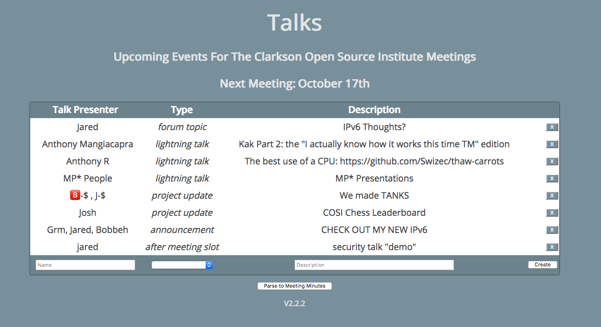

# rust_talks

rust_talks (Or more commonly known as just Talks) is an app to manage talks at COSI meetings.

It allows people to submit talks that they are planning on giving at upcoming meetngs. As well, it includes an export functionality to aggregate active talks to be put into a markdown format which is used for our meeting minutes.

## Endpoints

| Request | Endpoint           | Desc                                    |
| :------ | :----------------- | :-------------------------------------- |
| GET     | /                  | The talks homepage                      |
| GET     | /health            | Indicates whether the service is up     |
| POST    | /register          | Registers a new client for live updates |
| POST    | /authenticate      | authenticates a client                  |
| GET     | /talks             | Returns the currently visible talks     |
| GET     | /ws/{id}           | Websocket endpoint                      |
| GET     | /static/*          | Serves static files                     |

## Todos

* Replace the "Next Meeting TBD" with the next meeting (js or rust)
* Parse to meeting minutes (js)
* /all endpoint (rust and js)
* Frontend error handling (js)
* Add debugging support (rust)
